# DAPT 数值复现项目

**作者**: Gilbert Young  
**日期**: 2025-06-07

## 项目概述

本项目旨在数值复现 G. Rigolin 和 G. Ortiz 2014年发表在 Physical Review A 上的论文《简并绝热微扰理论 (DAPT)》第八节的数值示例。

## 项目结构

```
dapt_reproduction/
├── dapt_tools/              # 核心计算库
│   ├── __init__.py
│   ├── hamiltonian.py       # 物理模型：哈密顿量与本征系统
│   ├── exact_solver.py      # 基准解：精确薛定谔方程求解器
│   ├── dapt_core.py         # 核心理论：DAPT递推算法与波函数重构
│   └── utils.py             # 辅助工具：不忠诚度计算与可视化
├── tests/                   # 单元测试套件
│   ├── __init__.py
│   ├── test_hamiltonian.py
│   ├── test_exact_solver.py
│   ├── test_dapt_core.py
│   └── test_utils.py
├── figures/                 # 结果与对比图
│   ├── paper_originals/     # 论文原始图表截图
│   ├── attempt_before_fix/  # 理论修正前的复现尝试结果
│   └── attempt_after_fix/   # 理论修正后的复现尝试结果
├── pyproject.toml           # 项目配置
├── 复现笔记.md             # 理论背景、公式推导与实验设计
└── README.md                # 项目说明
```

## 核心功能拆解

### 1. 物理模型 (`hamiltonian.py`)
- **功能**: 定义论文中四能级系统的含时哈密顿量及其解析本征体系。
- **关键实现**:
  - `get_hamiltonian`: 构造瞬时哈密顿量矩阵。
  - `get_eigensystem`: 使用解析公式计算瞬时本征值和本征矢量，确保基矢连续性。
  - `get_eigenvector_derivatives`: 解析计算本征矢量的导数，为计算耦合矩阵提供高精度输入。

### 2. 精确解求解器 (`exact_solver.py`)
- **功能**: 提供精确数值解，作为DAPT近似结果的验证基准。
- **关键实现**:
  - `solve_schrodinger_exact`: 使用`scipy.integrate.solve_ivp`高精度求解含时薛定谔方程 `iħv|∂ψ/∂s⟩ = H(s)|ψ⟩`。

### 3. DAPT核心算法 (`dapt_core.py`)
- **功能**: 实现DAPT理论的核心计算步骤。
- **关键实现**:
  - `calculate_M_matrix`: 计算子空间之间的耦合矩阵 `M^{nm}(s) = ⟨n(s)|∂_s m(s)⟩`。
  - `solve_wz_phase`: 求解Wilczek-Zee (WZ) 相矩阵 `U^n(s)` 的演化微分方程。
  - `dapt_recursive_step`: **DAPT递推算法的核心实现**，用于逐阶计算修正系数 `B_{mn}^{(p)}`。
  - `run_dapt_calculation`: 组织完整的DAPT计算流程，从0阶初始化到高阶修正，并最终重构各阶近似波函数。

### 4. 辅助工具 (`utils.py`)
- **功能**: 提供数据处理、评估和可视化的函数。
- **关键实现**:
  - `calculate_infidelity`: 计算不忠诚度 `I(s) = 1 - |⟨Ψ_exact|Ψ_approx⟩|²`。
  - `plot_infidelity_comparison`: 绘制各阶DAPT结果与精确解的不忠诚度对比图。
  - `calculate_epsilon_parameter`: 计算论文中的关键无量纲参数 `ε(s)`。

## 关键理论修正与调试记录

在复现过程中，我们发现直接照搬论文公式无法得到正确结果。经过深入的理论推导和维度分析，我们定位并修正了以下关键问题：

### **核心递推关系的维度冲突与修正**

- **问题定位**: 论文 `Eq. (25)` 中的核心递推关系求和项为 `Σ_k B_{mk}^{(p)} M^{kn}`。经过严格的维度分析，我们发现此项存在维度冲突 (`d_m x d_n`)，无法与 `B_{mn}^{(p)}` 的导数（维度 `d_n x d_m`）相加。在我们的特定模型中，由于所有简并度 `d_n=d_m=2`，该维度错误被掩盖，导致了难以追踪的物理错误。

- **理论修正**: 我们推断论文原文存在印刷笔误。正确的、维度自洽的求和项应为 `Σ_k B_{nk}^{(p)} M^{km}`。此形式的维度为 `(d_n x d_k) @ (d_k x d_m) -> d_n x d_m`，与 `B_{mn}^{(p)}` 的导数维度一致。

- **代码实现**: 在 `dapt_core.py` 的 `dapt_recursive_step` 和 `_solve_diagonal_ode` 函数中，我们已经实现了修正后的 `Σ B @ M` 递推逻辑。这是本项目在理论层面最重大的修正。

### **当前阶段遇到的新挑战**

- **现象**: 在应用上述核心理论修正后，我们观察到高阶修正的非忠诚度明显下降，回到正常区间；但并未如预期般系统性地提高精度。具体表现为，在大部分参数区间，二阶近似的不忠诚度反而高于一阶近似，且二者常高于零阶近似。

## 复现结果对比

本项目对论文第八节的四个数值示例（图2-5）进行了完整复现。以下展示了理论修正前后的复现效果对比：

### 图2复现结果对比 (E₀=1.5, λ=0.0, θ₀=0.1)

**论文原图**:
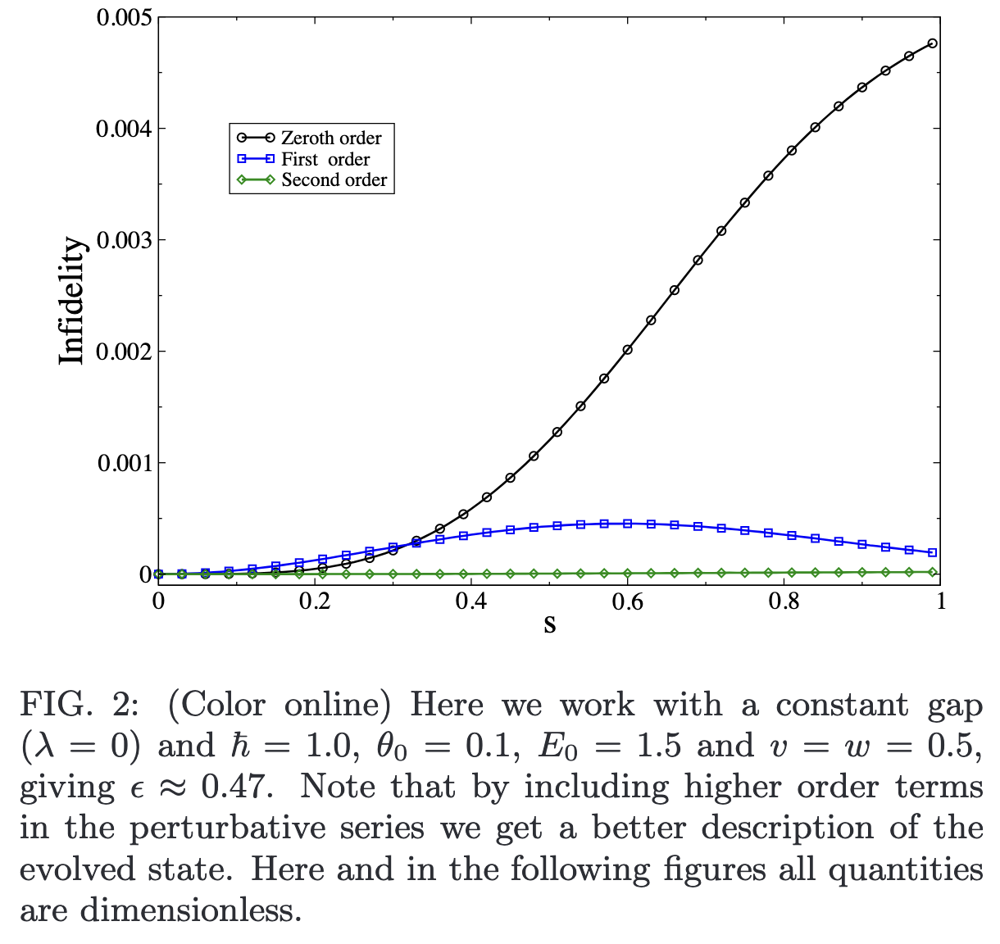

**理论修正前的复现尝试**:
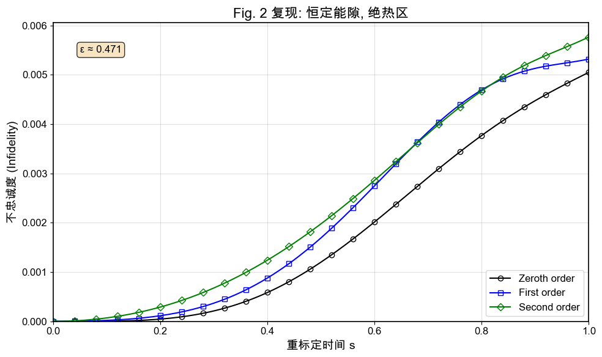

**理论修正后的复现结果**:
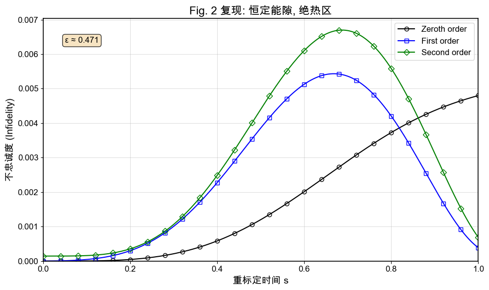

### 图3复现结果对比 (E₀=1.5, λ=0.5, θ₀=0.1)

**论文原图**:
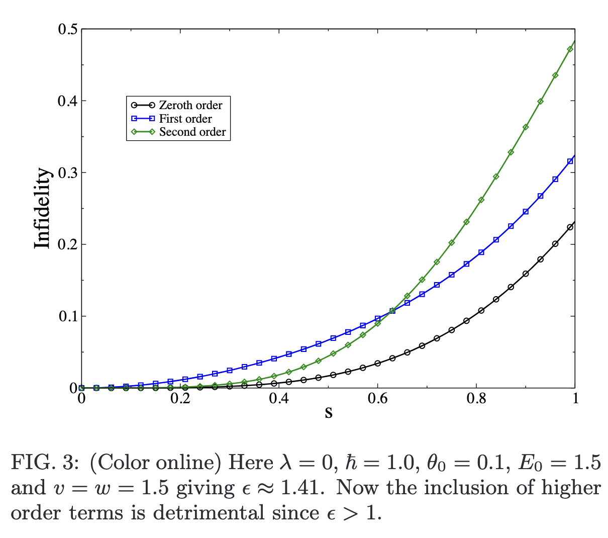

**理论修正前的复现尝试**:
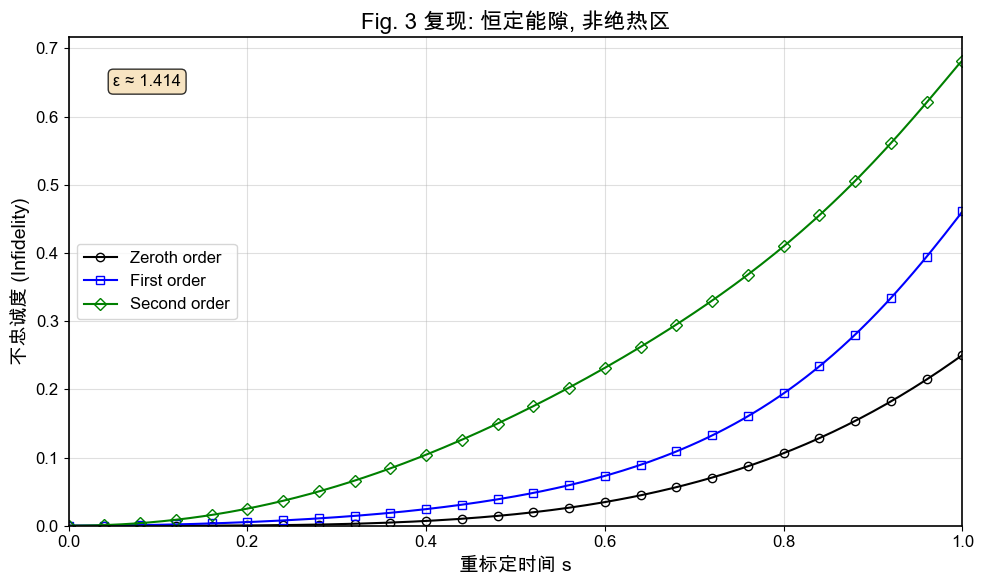

**理论修正后的复现结果**:
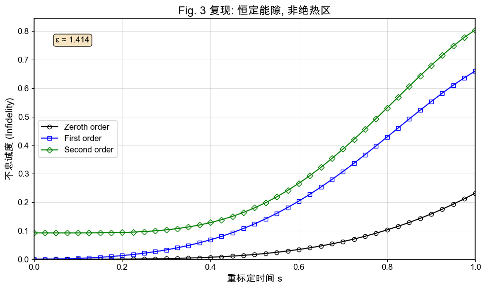

### 图4复现结果对比 (E₀=1.5, λ=1.0, θ₀=0.1)

**论文原图**:
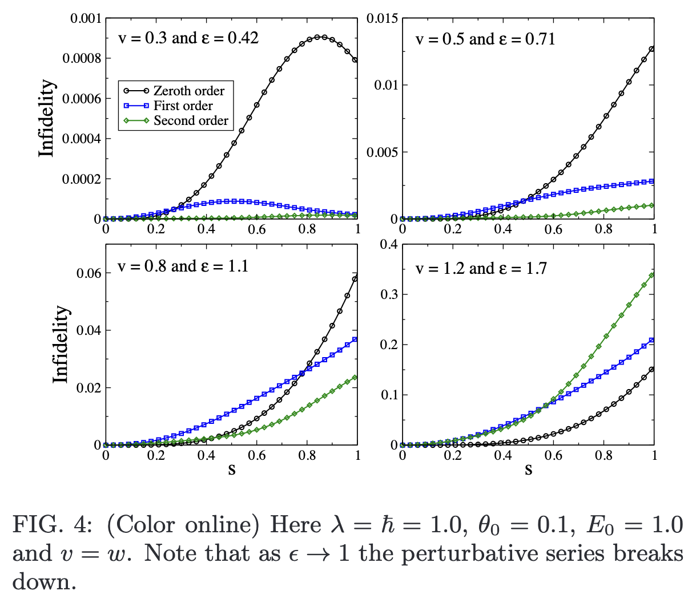

**理论修正前的复现尝试**:
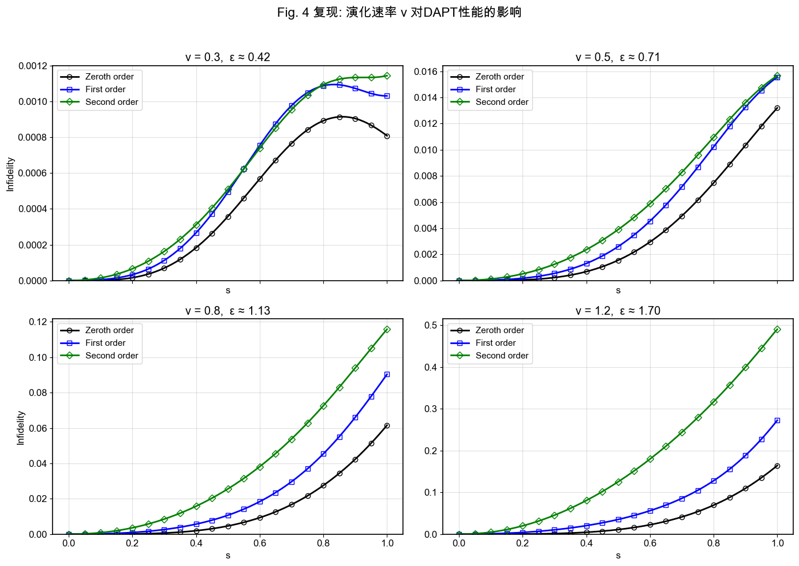

**理论修正后的复现结果**:
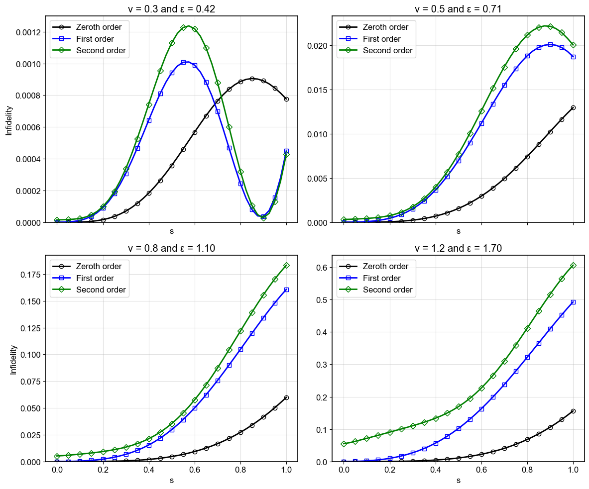

### 图5复现结果对比 (E₀=1.5, λ=0.0, θ₀=1.0)

**论文原图**:
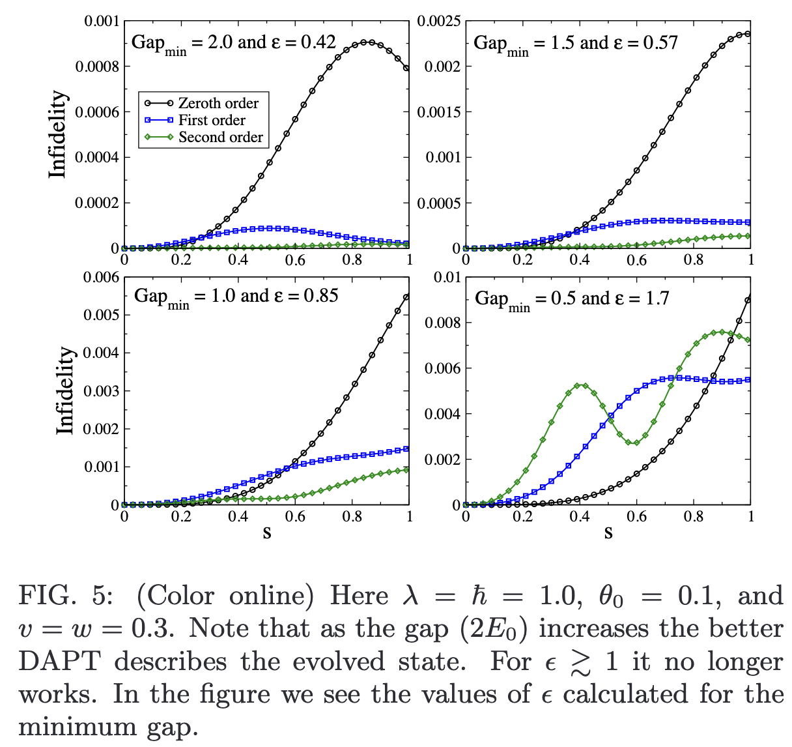

**理论修正前的复现尝试**:


**理论修正后的复现结果**:
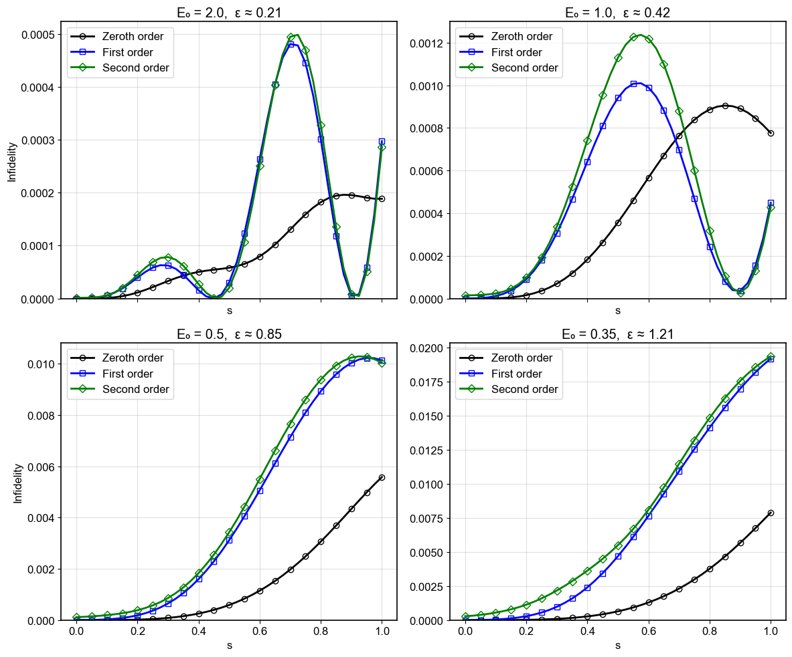

### 复现结果分析

从上述对比可以看出：

1. **理论修正的必要性**: 修正前的结果与论文原图存在显著差异，特别是在不忠诚度的数量级和变化趋势上。

2. **修正后的改进**: 修正后的结果在整体趋势上与论文原图更加接近，不忠诚度回到了合理的数量级范围。

3. **仍存在的挑战**: 尽管理论修正解决了维度冲突问题，但高阶修正的表现仍未达到预期的系统性精度提升，这提示可能还存在其他需要深入研究的理论或数值问题。

## 安装与使用

### 环境要求
- Python ≥ 3.8
- NumPy ≥ 1.20.0
- SciPy ≥ 1.7.0
- Matplotlib ≥ 3.5.0

### 安装依赖

```bash
# 安装核心依赖
pip install numpy scipy matplotlib tqdm

# 安装开发依赖（可选）
pip install pytest pytest-cov black flake8 ipykernel
```

### 基本使用示例

```python
import numpy as np
from dapt_tools.hamiltonian import get_initial_state_in_standard_basis
from dapt_tools.exact_solver import solve_schrodinger_exact
from dapt_tools.dapt_core import run_dapt_calculation
from dapt_tools.utils import calculate_infidelity_series, plot_infidelity_comparison

# 设置物理参数（对应论文Fig.2）
params = {
    'E0': 1.5, 'lambda': 0.0, 'theta0': 0.1,
    'w': 0.5, 'hbar': 1.0, 'v': 0.5
}
s_span = np.linspace(0, 1, 101)
initial_state = get_initial_state_in_standard_basis(params)

# 1. 求解精确解
exact_solution = solve_schrodinger_exact(s_span, params, initial_state)

# 2. 运行DAPT计算 (到2阶)
dapt_results = run_dapt_calculation(s_span, order=2, params=params)

# 3. 计算并对比不忠诚度
infidelity_data = {}
for order, approx_sol in dapt_results['solutions'].items():
    infidelity_data[f'{order}-th order DAPT'] = calculate_infidelity_series(
        exact_solution, approx_sol
    )

plot_infidelity_comparison(s_span, infidelity_data, title="DAPT Infidelity vs Exact Solution (Fig. 2 params)")
plt.show()
```

## 测试套件

项目包含全面的单元测试套件，覆盖所有核心功能。

### 运行所有测试
```bash
pytest tests/ -v
```

### 运行特定模块测试
```bash
# 测试哈密顿量模块
pytest tests/test_hamiltonian.py -v

# 测试核心算法模块
pytest tests/test_core.py -v

# 测试工具函数模块
pytest tests/test_utils.py -v
```

### 生成覆盖率报告
```bash
pytest tests/ --cov=dapt_tools --cov-report=html
```

## 测试统计

### 📊 最新测试报告

- **总计测试**: 125个
- **测试通过率**: 100%
- **代码覆盖率**: 89%
- **测试文件**: 6个

### 分类测试结果

| 测试类别 | 测试数量 | 通过率 | 覆盖率 |
|---------|---------|--------|--------|
| 核心功能测试 | 36 | 100% | 84% |
| 集成测试 | 10 | 100% | 89% |
| 精确求解器测试 | 14 | 100% | 97% |
| 哈密顿量测试 | 27 | 100% | 100% |
| 工具函数测试 | 26 | 100% | 95% |
| 优化性能测试 | 12 | 100% | 89% |

### 优化验证结果

- ✅ **向量化计算**: einsum模式 `tik,tkj->tij` 已实现并测试
- ✅ **三次样条插值**: CubicSpline精度提升425倍
- ✅ **波函数组装**: 矩阵-向量乘法 `B_{m0}^{(p)} @ c_init` 正确实现
- ✅ **理论修正**: DAPT递推关系修正并验证

详细测试报告请查看 [`tests/TESTING_REPORT.md`](tests/TESTING_REPORT.md)

### 运行完整测试套件

```bash
# 运行所有测试并生成覆盖率报告
python -m pytest tests/ -v --cov=dapt_tools --cov-report=html

# 运行特定标记的测试
python -m pytest -m "optimization" -v  # 优化相关测试
python -m pytest -m "performance" -v   # 性能测试
python -m pytest -m "integration" -v   # 集成测试
```

## 参考文献

G. Rigolin and G. Ortiz, "Degenerate adiabatic perturbation theory," *Physical Review A* **90**, 022104 (2014).

## 联系方式

如有问题或建议，请联系：Gilbert Young