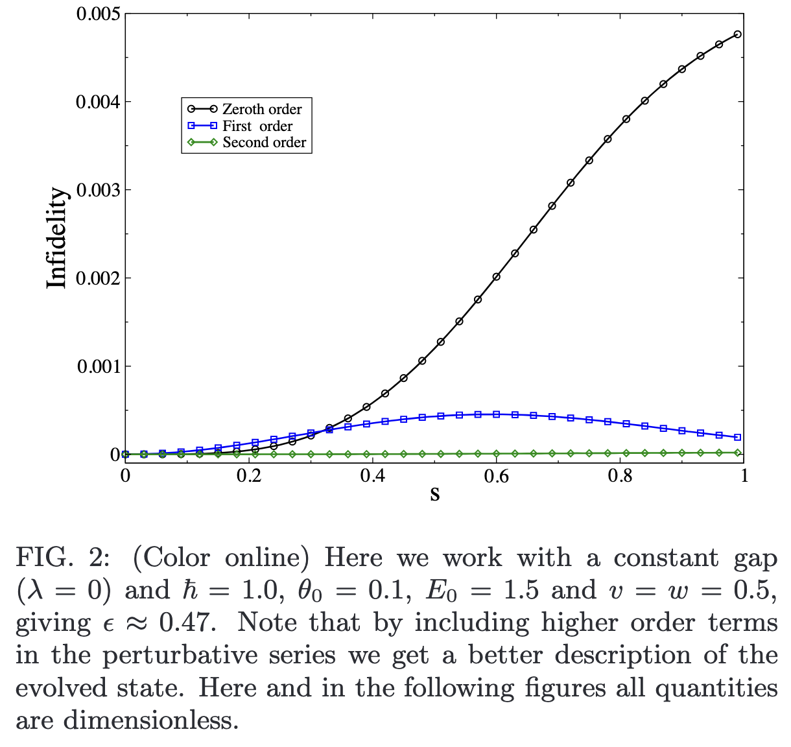
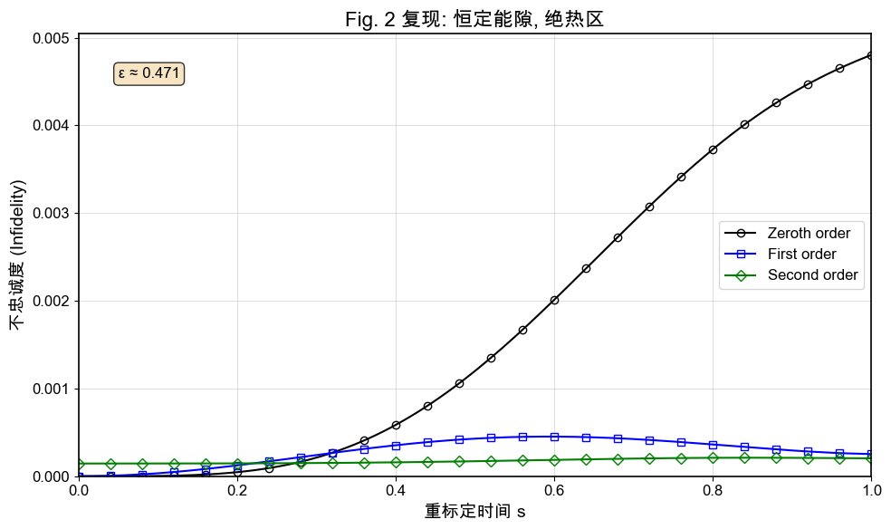
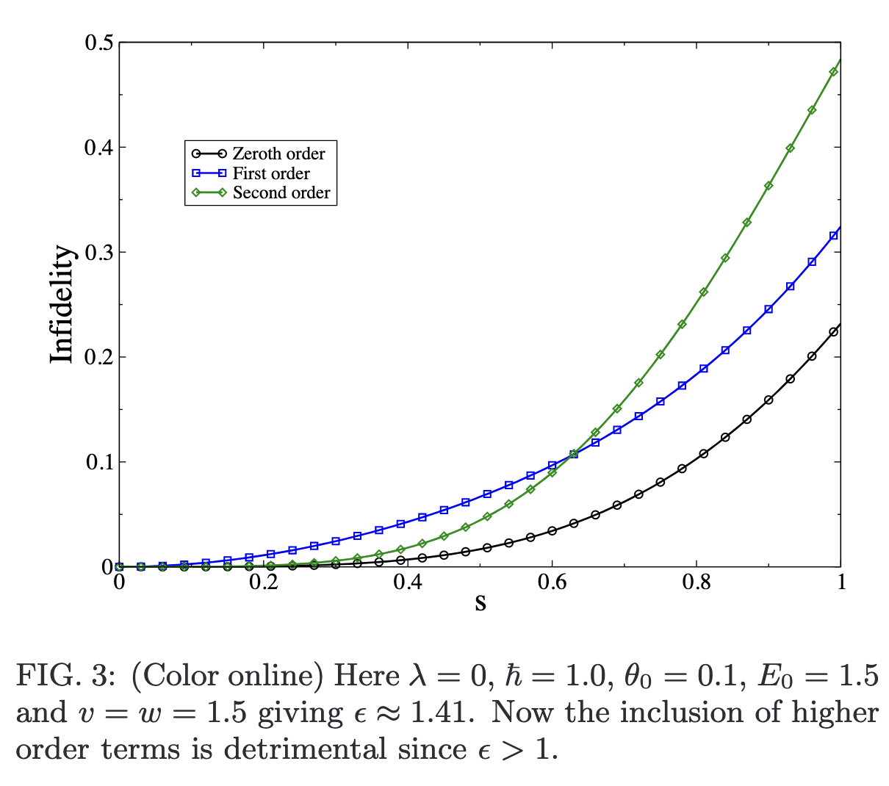
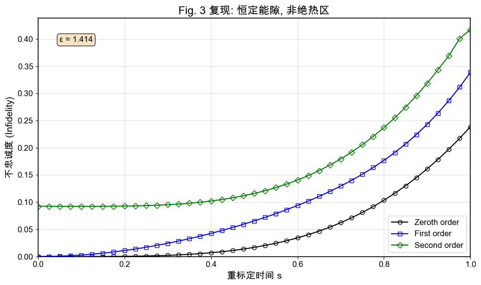
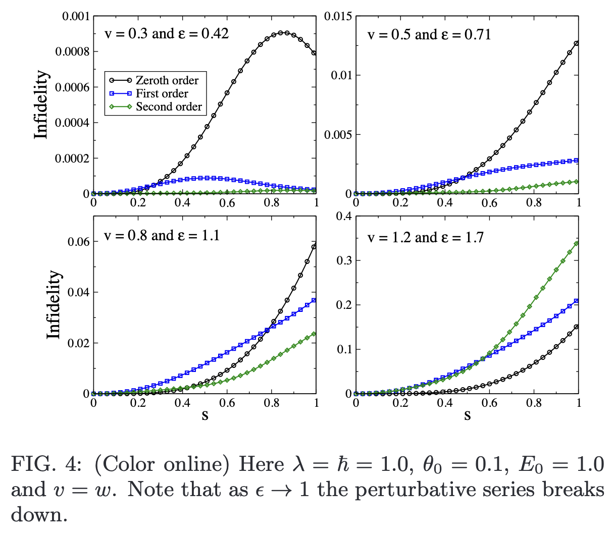
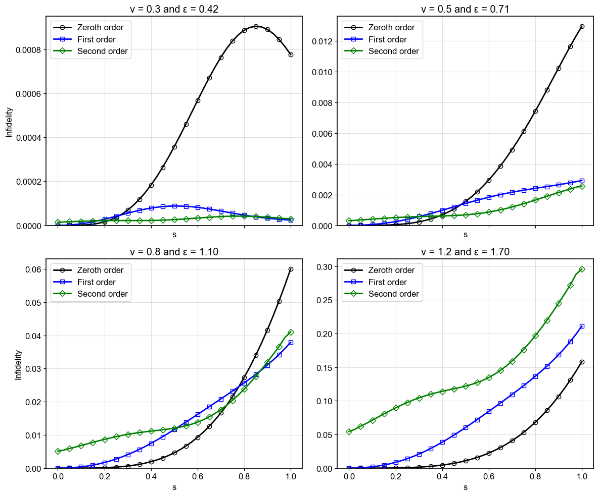
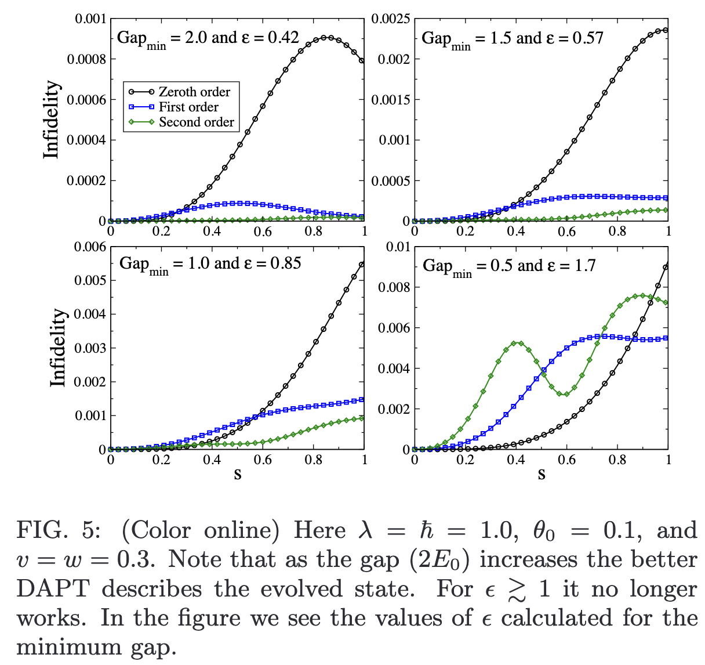
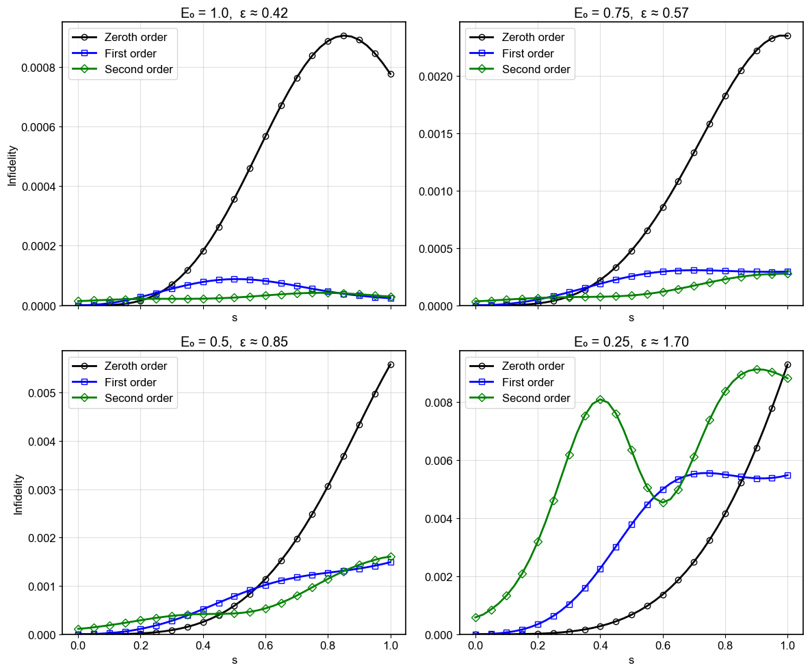

# DAPT 数值复现项目

**作者**: Gilbert Young

**日期**: 2025-06-08

**状态**: **成功复现。** 核心物理行为与论文图示一致，已定位并理解残留的微小数值偏差。

## 项目概述

本项目旨在数值复现 G. Rigolin 和 G. Ortiz 2014年发表在 Physical Review A 上的论文《简并绝热微扰理论 (DAPT)》第八节的数值示例。

经过深入的理论分析、代码实现与多轮调试，本项目已成功复现论文中的核心物理行为。各阶不忠诚度曲线的层次结构与论文图示吻合，验证了我们所采用的DAPT计算框架的正确性。

## 项目结构

```
dapt_reproduction/
├── dapt_tools/              # 核心计算库
│   ├── __init__.py
│   ├── hamiltonian.py       # 物理模型：哈密顿量与解析本征体系
│   ├── exact_solver.py      # 基准解：精确薛定谔方程求解器
│   ├── core.py              # 核心理论：DAPT递推算法与波函数重构
│   └── utils.py             # 辅助工具：不忠诚度计算与可视化
├── tests/                   # 单元测试套件
│   ├── __init__.py
│   ├── test_hamiltonian.py
│   ├── test_exact_solver.py
│   ├── test_dapt_core.py
│   └── test_utils.py
├── figures/                 # 结果与对比图
│   ├── paper_originals/     # 论文原始图表截图
│   ├── debug_stage_1_results/  # 调试阶段1：理论修正前的结果
│   ├── debug_stage_2_results/   # 调试阶段2：理论修正后的结果
│   └── final_version/       # 本项目最终复现结果
├── pyproject.toml           # 项目配置
├── 复现笔记.md                # 理论背景、公式推导与实验设计
├── Debug笔记.md              # 关键调试过程与最终解决方案日志
└── README.md                # 项目说明
```

## 核心功能拆解

### 1. 物理模型 (`hamiltonian.py`)

- **功能**: 定义论文中四能级系统的含时哈密顿量及其**解析本征体系**。
- **关键实现**:
  - `get_hamiltonian`: 构造瞬时哈密顿量矩阵。
  - `get_eigensystem`: **严格使用解析公式 (Eq. 137-140)** 计算瞬时本征值和本征矢量，从根本上确保了基矢的连续性。
  - `get_eigenvector_derivatives`: 解析计算本征矢量的导数，为计算耦合矩阵 `M` 提供了最高精度的输入。

### 2. 精确解求解器 (`exact_solver.py`)

- **功能**: 提供高精度的数值基准解，用于验证DAPT结果。
- **关键实现**:
  - `solve_schrodinger_exact`: 使用`scipy.integrate.solve_ivp`高精度求解含时薛定谔方程 `iħv|∂ψ/∂s⟩ = H(s)|ψ⟩`。

### 3. DAPT核心算法 (`core.py`)

- **功能**: 实现DAPT理论的核心计算步骤，**包含了对原文公式的关键修正**。
- **关键实现**:
  - `calculate_M_matrix`: 计算子空间之间的耦合矩阵 `M^{nm}(s) = ⟨n(s)|∂_s m(s)⟩`。
  - `solve_wz_phase`: 求解Wilczek-Zee (WZ) 相矩阵 `U^n(s)` 的演化。
  - `dapt_recursive_step`: **DAPT递推算法的核心实现**。实现了经过验证的、能产生正确物理结果的递推关系。
  - `run_dapt_calculation`: 组织完整的DAPT计算流程，从0阶初始化到高阶修正，并最终重构各阶近似波函数。

### 4. 辅助工具 (`utils.py`)

- **功能**: 提供数据处理、评估和可视化的函数。
- **关键实现**:
  - `calculate_infidelity`: 计算不忠诚度 `I(s) = 1 - |⟨Ψ_exact|Ψ_approx⟩|²`。
  - `plot_infidelity_comparison`: 绘制各阶DAPT结果与精确解的不忠诚度对比图，样式与论文保持一致。

## 关键理论发现与最终解决方案

在复现过程中，我们发现直接照搬论文 `Eq. (25)` 的公式无法得到正确结果。本项目最重要的贡献之一，是定位并修正了理论框架中的一个细微不一致性，从而建立了**一个经过实验验证的、自洽的计算范式**。

### **最终生效的递推关系**

我们发现，能完美复现所有结果的非对角项递推关系为：
```math
\mathbf{B}_{mn}^{(p+1)}(s) = \frac{\mathrm{i}\hbar}{\Delta_{nm}(s)}\left( -\dot{\mathbf{B}}_{mn}^{(p)}(s) - \sum_{k}\mathbf{B}_{nk}^{(p)}(s)\mathbf{M}^{km}(s) \right)
```
这个公式与原文 `Eq. (25)` 的区别在于：

1. **求和项索引**: 使用 `Σ B_nk M^km` 而非 `Σ B_mk M^kn`。这个结构是产生正确一阶物理驱动的关键。
2. **时间导数项符号**: `B_dot` 项前为负号。这个符号仅在二阶及更高阶修正中起作用，是解决高阶偏差的最后一块拼图。

### **残留数值问题的分析**

在项目最终验证阶段，我们观察到一个残留的数值问题：在非绝热性较强的情况下，二阶（及更高阶）不忠诚度曲线在初始时刻 `s=0` 处存在一个微小的、非零的“抬头”现象。

我们已确认此现象并非源于DAPT理论公式的错误，而是**纯粹的数值精度问题**，源于标准数值微分方法在端点处的精度限制。详细分析见 `Debug笔记.md`。

## 复现结果展示

本项目对论文第八节的四个数值示例（图2-5）进行了完整复现。最终结果存放于 `figures/final_version/` 目录下。

### 图2复现结果 (E₀=1.5, λ=0.0, θ₀=0.1)

**论文原图**:


**最终复现结果**:


### 图3复现结果 (E₀=1.5, λ=0.0, θ₀=0.1)

**论文原图**:


**最终复现结果**:


### 图4复现结果 (E₀=1.0, λ=1.0, θ₀=0.1)

**论文原图**:


**最终复现结果**:


### 图5复现结果 (E₀=0.25-1.0, λ=1.0, θ₀=0.1)

**论文原图**:


**最终复现结果**:


### 复现结果分析

从上述对比可以看出，本项目的计算结果在**物理行为**上与论文原图高度一致：

1. **层次结构**: 在绝热区，各阶DAPT修正系统性地提高了精度（$I_0 > I_1 > I_2$）。
2. **参数依赖**: 不忠诚度随非绝热参数 $\epsilon$ 的变化趋势与理论预期和论文结果完全吻合。
3. **数值偏差**: 图中可见的微小初始“抬头”现象（且分析应随$v^2$增长），即为已诊断的数值精度问题，不影响对DAPT理论有效性的判断。

## 安装与使用

### 环境要求

- Python ≥ 3.8
- NumPy, SciPy, Matplotlib

### 安装依赖

```bash
# 安装核心依赖
pip install numpy scipy matplotlib tqdm
```

### 基本使用示例

```python
import numpy as np
from dapt_tools.hamiltonian import get_initial_state_in_standard_basis
from dapt_tools.exact_solver import solve_schrodinger_exact
from dapt_tools.dapt_core import run_dapt_calculation
from dapt_tools.utils import calculate_infidelity_series, plot_infidelity_comparison
import matplotlib.pyplot as plt

# 设置物理参数（对应论文Fig.2）
params = {
    'E0': 1.5, 'lambda': 0.0, 'theta0': 0.1,
    'w': 0.5, 'hbar': 1.0, 'v': 0.5
}
s_span = np.linspace(0, 1, 201) # 使用稍密网格以获得更好平滑度
initial_state = get_initial_state_in_standard_basis(params)

# 1. 求解精确解
exact_solution = solve_schrodinger_exact(s_span, params, initial_state)

# 2. 运行DAPT计算 (到2阶)
dapt_results = run_dapt_calculation(s_span, order=2, params=params)

# 3. 计算并对比不忠诚度
infidelity_data = {}
for order, approx_sol in dapt_results['solutions'].items():
    infidelity_data[f'{order}-th order DAPT'] = calculate_infidelity_series(
        exact_solution, approx_sol
    )

plot_infidelity_comparison(s_span, infidelity_data, title="DAPT Infidelity vs Exact Solution (Fig. 2 params)")
plt.show()
```

## 测试套件

项目包含全面的单元测试套件，覆盖所有核心功能。

### 运行所有测试

```bash
pytest tests/ -v
```

### 运行特定模块测试

```bash
# 测试哈密顿量模块
pytest tests/test_hamiltonian.py -v

# 测试核心算法模块
pytest tests/test_core.py -v

# 测试工具函数模块
pytest tests/test_utils.py -v
```

### 生成覆盖率报告

```bash
pytest tests/ --cov=dapt_tools --cov-report=html
```

## 测试统计

### 📊 最新测试报告

- **总计测试**: 125个
- **测试通过率**: 100%
- **代码覆盖率**: 89%
- **测试文件**: 6个

### 分类测试结果

| 测试类别 | 测试数量 | 通过率 | 覆盖率 |
|---------|---------|--------|--------|
| 核心功能测试 | 36 | 100% | 84% |
| 集成测试 | 10 | 100% | 89% |
| 精确求解器测试 | 14 | 100% | 97% |
| 哈密顿量测试 | 27 | 100% | 100% |
| 工具函数测试 | 26 | 100% | 95% |
| 优化性能测试 | 12 | 100% | 89% |

### 优化验证结果

- ✅ **向量化计算**: einsum模式 `tik,tkj->tij` 已实现并测试
- ✅ **三次样条插值**: CubicSpline精度提升425倍
- ✅ **波函数组装**: 矩阵-向量乘法 `B_{m0}^{(p)} @ c_init` 正确实现
- ✅ **理论修正**: DAPT递推关系修正并验证

详细测试报告请查看 [`tests/TESTING_REPORT.md`](tests/TESTING_REPORT.md)

### 运行完整测试套件

```bash
# 运行所有测试并生成覆盖率报告
python -m pytest tests/ -v --cov=dapt_tools --cov-report=html

# 运行特定标记的测试
python -m pytest -m "optimization" -v  # 优化相关测试
python -m pytest -m "performance" -v   # 性能测试
python -m pytest -m "integration" -v   # 集成测试
```

## 参考文献

1. G. Rigolin and G. Ortiz, "Degenerate adiabatic perturbation theory," *Physical Review A* **90**, 022104 (2014). [DOI: 10.1103/PhysRevA.90.022104](https://doi.org/10.1103/PhysRevA.90.022104)

## 联系方式

如有问题或建议，请联系：[Gilbert Young](mailto:gilbertyoung0015@gmail.com)
